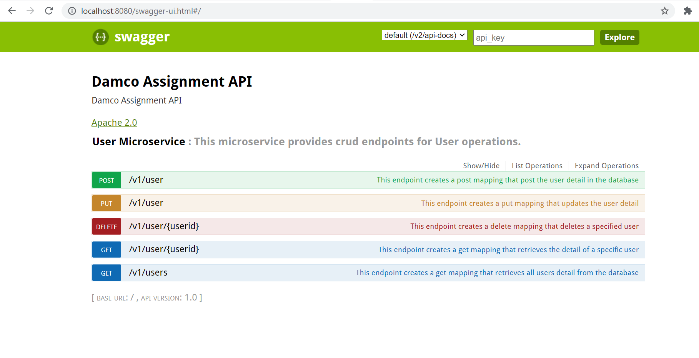

# User Microservice
This microservice exposes endpoints for User CRUD Operations.

Swagger Documentation Link : http://localhost:8080/swagger-ui.html

Pre-requisites:
1) Pre-installed Java 1.8
2) Pre-installed Maven

 Steps to run the application:  

Step 1) Clone\Download the application.
\
\
Step 2) Open terminal and go to application directory
\
\
Step 3) Run > mvn install
\
\
Step 4) Run > mvn clean package
\
\
Step 5) Run > java -jar target\damcoMicroservice-0.0.1-SNAPSHOT.jar
\
\

To close the application press ctrl+c

Here's a snapshot of Swagger Documentation:

